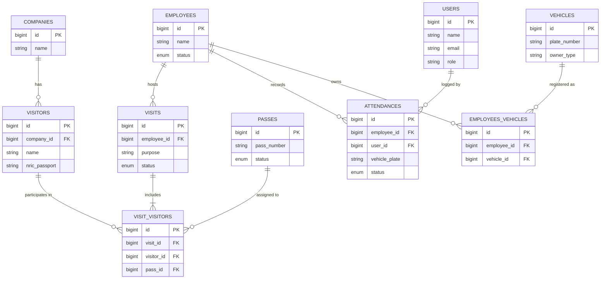

# Visitor Management System (VMSystem)

Welcome to the Visitor Management System (VMSystem) repository. This application is designed to handle visitor registration, employee attendance, and comprehensive reporting to streamline front-desk operations and office security.

## 🚀 Features

- **Dashboard:** Real-time overview of today's active and completed visits.
- **Visitor Management:** Register visitors, check-in, check-out, and track visitor statuses. Search for returning visitors via NRIC.
- **Employee Management:** Manage staff records and employee details.
- **Employee Attendance:** Clock-in, clock-out, and check-in updates for employees.
- **Reporting:** Generate and print comprehensive reports on visitor activity and attendance.
- **Data Import:** Bulk import functionality to load existing records into the system.

## 🛠️ Technology Stack

- **Framework:** [Laravel](https://laravel.com) (PHP ^8.3)
- **Database:** MySQL 8.0
- **Cache/Queue:** Redis
- **Environment:** Docker & Docker Compose
- **Additional Libraries:**
  - `barryvdh/laravel-dompdf` for PDF report generation
  - `phpoffice/phpspreadsheet` for Excel/CSV data imports and exports

## ⚙️ System Requirements

Ensure your system meets the following requirements:
- **Docker** & **Docker Compose**
- Node.js & NPM (optional, for local frontend compilation if needed outside the container)

## 📦 Installation & Setup (Docker)

The system is fully dockerized to ensure a consistent development and production environment.

1. **Clone the repository:**
   ```bash
   git clone <repository-url>
   cd vmsystem
   ```

2. **Configure the Environment:**
   Copy the example environment file:
   ```bash
   cp .env.example .env
   ```
   *Make sure your `.env` contains the correct database and redis settings (they should match your `docker-compose.yml`):*
   ```env
   DB_CONNECTION=mysql
   DB_HOST=db
   DB_PORT=3306
   DB_DATABASE=vmsystem
   DB_USERNAME=vmsystem_user
   DB_PASSWORD=secret
   
   REDIS_HOST=redis
   REDIS_PASSWORD=null
   REDIS_PORT=6379
   ```

3. **Build and Start the Containers:**
   Spin up the PHP, MySQL, and Redis containers in detached mode:
   ```bash
   docker-compose up -d --build
   ```

4. **Install Dependencies:**
   Run composer install inside the PHP container:
   ```bash
   docker-compose exec php composer install
   ```

5. **Generate Application Key:**
   ```bash
   docker-compose exec php php artisan key:generate
   ```

6. **Run Migrations and Seeders:**
   Set up the database schema and initial data:
   ```bash
   docker-compose exec php php artisan migrate --seed
   ```

7. **Compile Frontend Assets:**
   Install NPM packages and build the frontend assets. (This can be run locally or via a node container if you have one configured):
   ```bash
   npm install
   npm run dev
   ```

8. **Access the Application:**
   The application will be running and accessible at `http://localhost:8000`.

## 📁 System Architecture

The core architecture follows the standard Laravel MVC (Model-View-Controller) design pattern.

### Key Directories

- `app/Http/Controllers/` - Contains the business logic for managing Visits, Employees, Attendance, and Reports.
- `routes/web.php` - Defines the web interface endpoints and middleware restrictions.
- `resources/views/` - Blade templates for the application's user interface.
- `docker-compose.yml` - Defines the services: `php` (application), `db` (MySQL 8.0), and `redis`.

### Authentication & Security
- The system uses built-in Laravel Authentication.
- Registration and password resets are disabled by default (`Auth::routes(['register' => false, ...])`) to prevent unauthorized public sign-ups. User provisioning should be done by an administrator via the CLI or admin interface.
- All core routes are protected by the `auth` middleware.

## 🧑‍💻 Docker Commands

Here are some helpful commands when working with this Docker setup:

- **View Logs:**
  ```bash
  docker-compose logs -f
  ```
- **Stop Containers:**
  ```bash
  docker-compose down
  ```
- **Access the PHP Container Shell:**
  ```bash
  docker-compose exec php bash
  ```
- **Run Artisan Commands:**
  ```bash
  docker-compose exec php php artisan <command>
  ```

## 🗄️ Database ERD



## 📄 License

This project is open-sourced software licensed under the [MIT license](https://opensource.org/licenses/MIT).
